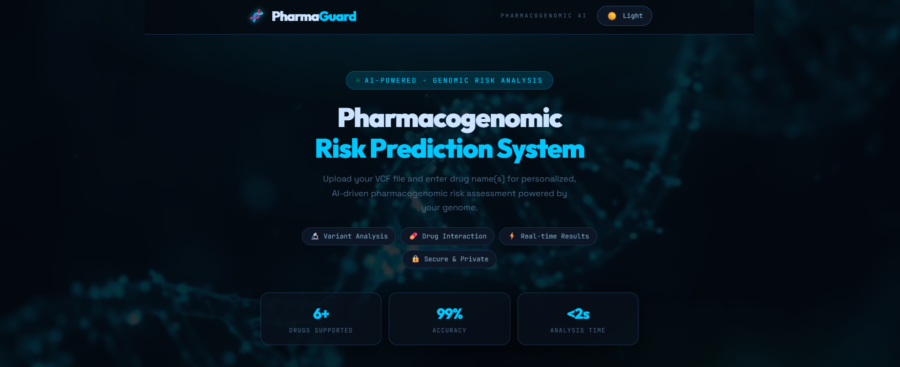
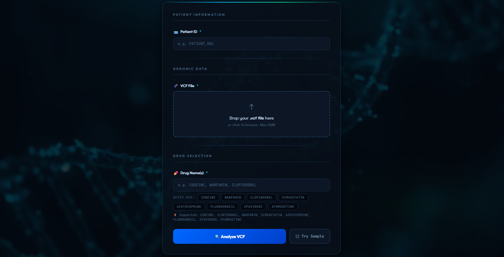
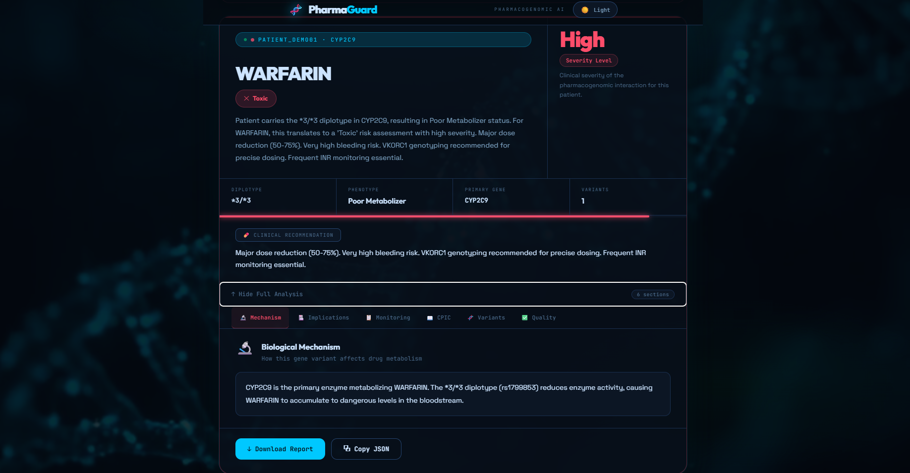

# PharmaGuard 🧬💊
### AI-Powered Pharmacogenomic Risk Prediction System

> Upload a patient's genetic file. Get personalized drug safety predictions — instantly.

**RIFT 2026 Hackathon · HealthTech / Pharmacogenomics Track**

---

## 🔗 Links

| | |
|---|---|
| 🌐 **Live Demo** | _https://techrx.netlify.app/_ |
| 📹 **Demo Video** | _https://www.linkedin.com/posts/h-r-madalambika-793502368_riftxpwioi-hackathon-24hourchallenge-activity-7430438593418133504-CoKn?utm_source=social_share_send&utm_medium=member_desktop_web&rcm=ACoAAFszDd8BuKVZ9NmpEL7tDXVnY2y9C3C3W_g_ |

---

## 🧬 What is PharmaGuard?

The same drug at the same dose can be completely safe for one patient — and life-threatening for another. The reason? Genetics.

**PharmaGuard** bridges that gap. It accepts a patient's VCF (Variant Call Format) genomic file and a list of drugs, then automatically:

1. Parses the VCF to extract pharmacogenomic variants across 7 critical genes
2. Maps detected star alleles to diplotypes and phenotypes using **CPIC guidelines**
3. Predicts drug-specific risk: `Safe` · `Adjust Dosage` · `Toxic` · `Ineffective`
4. Generates plain-English clinical explanations using **GPT-4** (or a rule-based fallback)
5. Returns a structured JSON report with actionable recommendations

<p align="center">
  
</p>
---

## 🏗️ Architecture

```
┌─────────────────────────────────────────────────────┐
│                    React Frontend                   │
│  FileUpload → DrugInput → Analyze → ResultsDisplay  │
└─────────────────────┬───────────────────────────────┘
                      │ HTTP POST /analyze (multipart)
┌─────────────────────▼───────────────────────────────┐
│                   FastAPI Backend                   │
│                                                     │
│  ┌──────────────┐  ┌─────────────┐  ┌────────────┐  │
│  │  VCF Parser  │→ │ Risk Engine │→ │LLM Explainer  │
│  └──────────────┘  └─────────────┘  └────────────┘  │
│                                                     │
│  Gene → Diplotype → Phenotype → Risk Label → JSON   │
└─────────────────────────────────────────────────────┘
```

**Data Flow:**
```
VCF File
  → Parse variants & filter by genotype (GT ≠ 0/0)
  → Extract star alleles per gene
  → Infer diplotype
  → Lookup phenotype (CPIC tables)
  → Predict drug risk
  → Generate LLM explanation
  → Return structured JSON report
```

<p align="center">
  
  &nbsp;
  
</p>

---

---

## 🧰 Tech Stack

| Layer | Technology |
|---|---|
| Frontend | React 18, Vite, CSS Variables |
| Backend | FastAPI, Python 3.10+ |
| VCF Parsing | Custom Python parser (VCF v4.2) |
| Risk Engine | CPIC guideline lookup tables |
| AI Explanations | OpenAI GPT-4 (rule-based fallback included) |
| Deployment | Vercel (frontend) + Render (backend) |

---

## 🧬 Supported Genes & Drugs

| Gene | Drug | Risk if Impaired |
|---|---|---|
| CYP2D6 | Codeine | Poor metabolizer → **Ineffective** (no morphine conversion) |
| CYP2D6 | Atomoxetine | Poor metabolizer → **Toxic** (10× plasma accumulation) |
| CYP2C19 | Clopidogrel | Poor metabolizer → **Ineffective** + cardiovascular risk |
| CYP2C9 | Warfarin | Poor metabolizer → **Toxic** (bleeding risk) |
| SLCO1B1 | Simvastatin | *5 variant → **Toxic** (myopathy, rhabdomyolysis) |
| TPMT | Azathioprine | Poor metabolizer → **Toxic** (life-threatening myelosuppression) |
| DPYD | Fluorouracil | Poor metabolizer → **Toxic** (fatal multi-organ toxicity) |
| CYP2B6 | Efavirenz | Poor metabolizer → CNS toxicity risk |

**Phenotypes supported:** `Poor Metabolizer` · `Intermediate Metabolizer` · `Normal Metabolizer` · `Rapid Metabolizer` · `Ultrarapid Metabolizer`

---

## 🚀 Getting Started

### Prerequisites
- Python 3.10+
- Node.js 18+
- npm or yarn

### Backend Setup

```bash
cd backend
pip install -r requirements.txt


# Start server
uvicorn main:app --reload --port 8000
```

### Frontend Setup

```bash
cd frontend
npm install

cp .env.example .env

npm run dev
```

Frontend runs at `http://localhost:5173`

---

## 📡 API Reference

### `POST /analyze`
Analyze a patient VCF file for pharmacogenomic drug risks.

**Request** (multipart/form-data):

| Field | Type | Required | Description |
|---|---|---|---|
| `vcf_file` | File (.vcf) | ✓ | Patient VCF file |
| `drugs` | String | ✓ | Comma-separated drug names |
| `patient_id` | String | — | Optional patient identifier |
| `openai_api_key` | String | — | Optional key for GPT-4 explanations |

**Response** (JSON):
```json
{
  "patient_id": "001",
  "drug": "SIMVASTATIN",
  "timestamp": "2026-02-19T23:58:43.452749Z",
  "risk_assessment": {
    "risk_label": "Safe",
    "confidence_score": 0.9,
    "severity": "none"
  },
  "pharmacogenomic_profile": {
    "primary_gene": "SLCO1B1",
    "diplotype": "*1/*1",
    "phenotype": "Normal Function",
    "detected_variants": []
  },
  "clinical_recommendation": {
    "recommendation": "Standard simvastatin dosing is appropriate. Normal SLCO1B1 function ensures adequate hepatic uptake and clearance. Prescribe desired starting dose per disease-specific guidelines (typically 20–40 mg/day). Routine CK monitoring not required.",
    "cpic_recommendation": "Prescribe desired starting dose per guidelines.",
    "requires_dose_adjustment": false,
    "contraindicated": false
  },
  "llm_generated_explanation": {
    "summary": "Patient carries the *1/*1 diplotype in SLCO1B1, resulting in Normal Function status. For SIMVASTATIN, this translates to a 'Safe' risk assessment with none severity. Standard simvastatin dosing is appropriate. Normal SLCO1B1 function ensures adequate hepatic uptake and clearance. Prescribe desired starting dose per disease-specific guidelines (typically 20–40 mg/day). Routine CK monitoring not required.",
    "mechanism": "SLCO1B1 encodes a hepatic uptake transporter that controls SIMVASTATIN uptake into liver cells. The *1/*1 diplotype impairs this transporter, reducing SIMVASTATIN clearance and increasing systemic exposure with risk of moderate muscle toxicity.",
    "clinical_implications": "This patient is expected to respond normally to standard SIMVASTATIN dosing. No pharmacogenomic-based dose adjustments are necessary.",
    "monitoring": "Routine clinical monitoring per standard of care.",
    "full_explanation": "Patient carries the *1/*1 diplotype in SLCO1B1, resulting in Normal Function status. For SIMVASTATIN, this translates to a 'Safe' risk assessment with none severity. Standard simvastatin dosing is appropriate. Normal SLCO1B1 function ensures adequate hepatic uptake and clearance. Prescribe desired starting dose per disease-specific guidelines (typically 20–40 mg/day). Routine CK monitoring not required.\n\nMechanism: SLCO1B1 encodes a hepatic uptake transporter that controls SIMVASTATIN uptake into liver cells. The *1/*1 diplotype impairs this transporter, reducing SIMVASTATIN clearance and increasing systemic exposure with risk of moderate muscle toxicity.\n\nClinical Implications: This patient is expected to respond normally to standard SIMVASTATIN dosing. No pharmacogenomic-based dose adjustments are necessary.\n\nMonitoring: Routine clinical monitoring per standard of care.",
    "generated_by": "rule-based-fallback",
    "generated_at": "2026-02-19T23:58:43.452734"
  },
  "quality_metrics": {
    "vcf_parsing_success": true,
    "total_variants_parsed": 1,
    "genes_detected": [
      "CYP2D6"
    ],
    "primary_gene_found": false,
    "explanation_source": "rule-based-fallback"
  }
}
```

### `POST /analyze/sample`
Run analysis using the built-in high-risk demo VCF (no file upload required).

### `GET /drugs`
Returns the list of all supported drug names.

---

## 📋 Usage Examples

**Basic analysis via curl:**
```bash
curl -X POST http://localhost:8000/analyze \
  -F "vcf_file=@patient.vcf" \
  -F "drugs=CODEINE,WARFARIN" \
  -F "patient_id=PATIENT_001"
```

**Run the sample demo case:**
```bash
curl -X POST http://localhost:8000/analyze/sample \
  -F "drugs=FLUOROURACIL,AZATHIOPRINE"
```

**VCF file format expected:**
```
##fileformat=VCFv4.2
##INFO=<ID=GENE,Number=1,Type=String,Description="Gene symbol">
##INFO=<ID=STAR,Number=1,Type=String,Description="Star allele">
##INFO=<ID=RS,Number=1,Type=String,Description="dbSNP rsID">
##FORMAT=<ID=GT,Number=1,Type=String,Description="Genotype">
#CHROM  POS       ID  REF  ALT  QUAL  FILTER  INFO              FORMAT  SAMPLE
chr22   42522613  .   C    T    .     PASS    GENE=CYP2D6;STAR=*4;RS=rs3892097  GT  1/1
```

> **Note:** The parser only includes variants where the patient actually carries the alternate allele (GT ≠ `0/0`). Homozygous reference calls are automatically filtered out.

---

## ☁️ Deployment

### Backend → Render

1. Push repo to GitHub
2. Create a new **Web Service** on [render.com](https://render.com)
3. Set root directory: `backend/`
4. Build command: `pip install -r requirements.txt`
5. Start command: `uvicorn main:app --host 0.0.0.0 --port $PORT`

### Frontend → Vercel

1. Import GitHub repo on [vercel.com](https://vercel.com)
2. Set root directory: `frontend/`
3. Add environment variable: `VITE_API_URL=https://your-render-url.onrender.com`
4. Deploy

---

## ⚠️ Known Limitations

- VCF files must include `GENE`, `STAR`, and `RS` tags in the INFO field
- Complex structural variants and copy number variations are not fully supported
- Diplotype inference is based on star alleles present in the VCF only
- LLM explanations require an OpenAI API key — falls back to rule-based explanations otherwise

---

## 👥 Team - NEXA

| Name |
|---|
| Kirtisree S |
| Rakshitha U |
| Harshita S |
| H R Madalambika |

BNM Institute of Technology | ECE | Bengaluru

---

> *PharmaGuard — because the right drug for the average patient isn't always the right drug for your patient.*